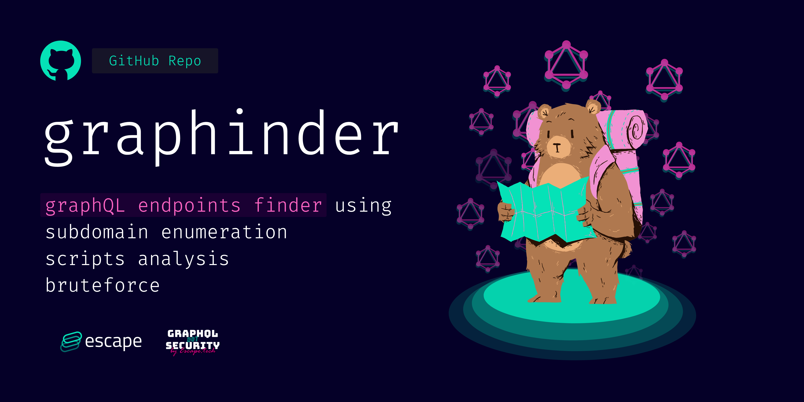
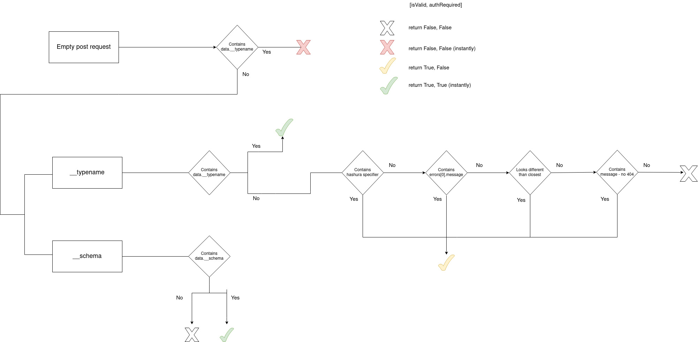

# Graphinder  [](https://github.com/Escape-Technologies/graphinder/actions/workflows/ci.yaml) [](https://codecov.io/gh/Escape-Technologies/graphinder)

Graphinder is a tool that extracts all GraphQL endpoints from a given domain.




## Run with docker

```bash
docker pull escapetech/graphinder
docker run -it --rm escapetech/graphinder -d example.com
```

If you want to save your results.json file, you can use:

```bash
docker run -it --name graphinder escapetech/graphinder -d example.com
docker cp graphinder:/graphinder/results.json results.json
docker rm -f graphinder
```

## Install using Pip

```bash
pip install graphinder

# using specific python binary
python3 -m pip install graphinder
```

Run it with

```bash
graphinder ...
```

## Usage

A Scan consistes of:

- Running specific domain (`-d`, `--domain`).
- Searching all scripts loaded by the browser for graphql endpoint (`-s`, `--script`)
- Brute forcing the directories of all discovered urls (`-b`, `--bruteforce`)
- Using precision mode (`-p`, `--precision`)

By default, bruteforce and script search are enabled.

```bash
graphinder -d example.com
```

```bash
graphinder -f domains.txt
```

### Extra features

- `--no-bruteforce`: Disable bruteforce
- `--no-script`: Disable script search
- `-p --precision --no-precision`: Enable/disable precision mode (default: enabled) (precision mode is slower but more accurate)
- `-w --max-workers <int>`: Maximum of concurrent workers on multiple domains.
- `-o --output-file <FILE_PATH>`: Output the results to file
- `-v --verbose --no-verbose`: Verbose mode
- `-r --reduce`: The maximum number of subdomains to scan.
- `-wb --webhook_url`: The discord webhook url to send the results to.

If you experience any issues, irregularities or networking bottlenecks, please reduce your number of workers, otherwise, better is your network, the more workers you can have.

## Local installation

Clone the repository and run the installation script

```bash
git clone https://github.com/Escape-Technologies/graphinder.git
cd graphinder
./install-dev.sh
```

Run this command to enter the virtual enviroment

```bash
poetry shell
```

Profit !

```bash
graphinder -d example.com
```

## How do you make sure this is a valid graphql endpoint ?



## Contributing

Pull requests are welcome. For major changes, please open an issue first to discuss what you would like to change.

Please make sure to update tests as appropriate.

## License 

[MIT](https://choosealicense.com/licenses/mit/)
